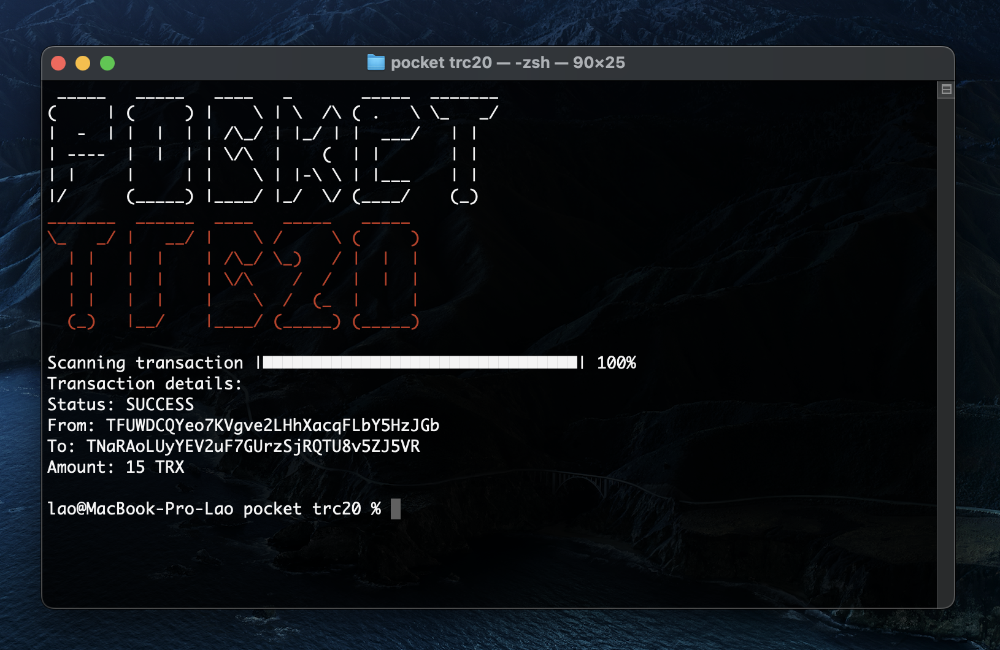
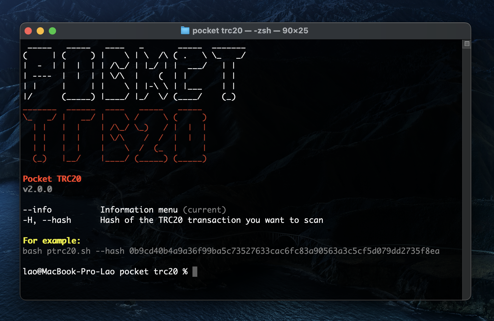

<h1 align="center">
  Pocket TRC20
</h1>
<p align="center">
  Console Tron Blockchain Scanner
</p>


* [More info](#more-info)
* [Installation](#installation)


## Screenshots
<p>
  
  
</p>


## More info
Pocket TRC20 is a console based TRON blockchain scanner.

It is used for getting details of TRC20 transactions just by entering 1 command into the terminal


## Installation
### MacOS/Linux
```
$ git clone https://github.com/codelao/CryptoScans.git
$ cd Pocket-TRC20
```
#### after that you can go to the information menu by using this command:
```
$ bash ptrc20.sh --info
```
#### or you can start scanning transactions by using only 1 command:
```
$ bash ptrc20.sh --hash Trc20TransactionHash
```
