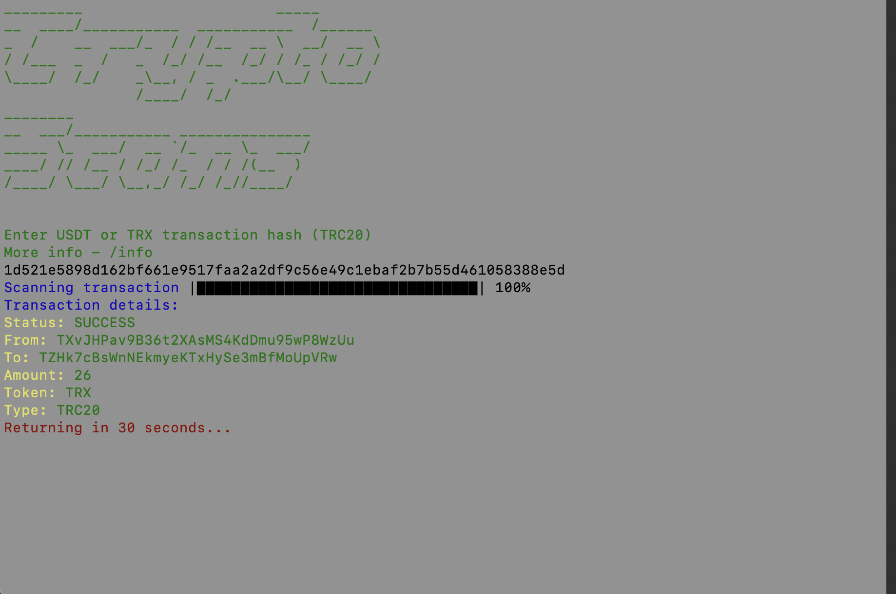

<p align="center">
  
</p>

<h1 align="center">
  Crypto Scans
</h1>

* [More info](#more-info)
* [Installation](#installation)
* [Usage](#usage)


## Screenshots
<p>
  
  
</p>


## More info
Crypto Scans is a console-based TRON blockchain explorer app
It is used for getting information about TRC20 transactions right through your PC's terminal


## Installation
*Note: you need to have Python installed in your system before moving to the next step*
```
$ git clone https://github.com/codelao/CryptoScans.git
$ cd CryptoScans
$ pip install -r requirements.txt
$ cd code
$ python main.py
```
*Note: if the last command doesn't work, run:*
```
$ python3 main.py
```
## Usage
After running Crypto Scans you can enter any TRC20 transaction hash in the terminal window and you will get the details of this transaction
