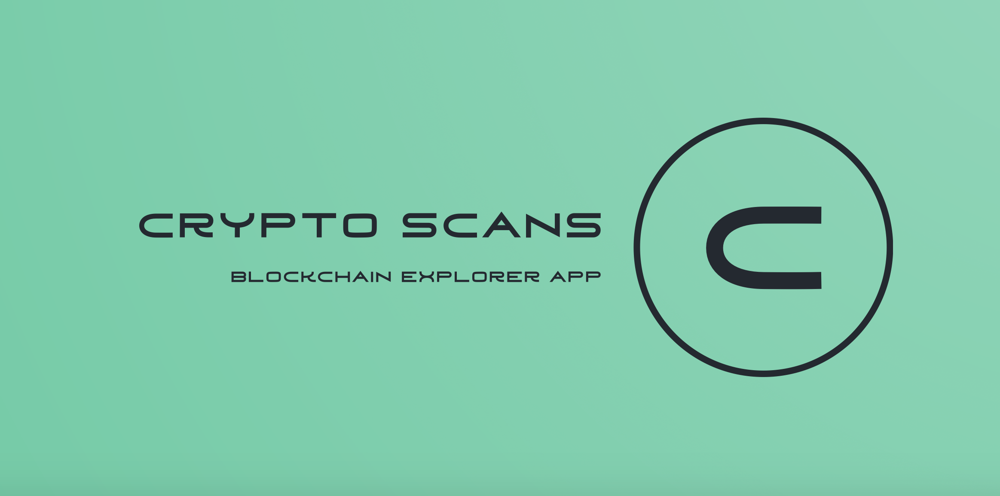
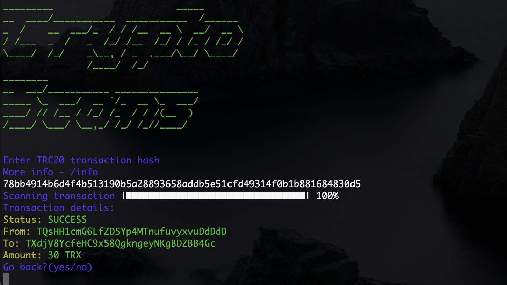
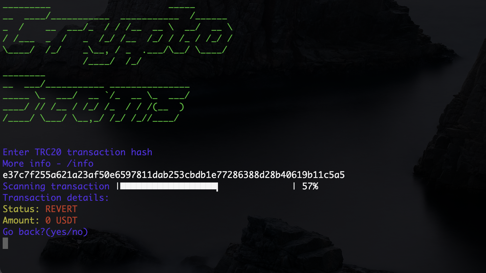

<p align="center">
  
</p>

<h1 align="center">
  Crypto Scans
</h1>

* [More info](#more-info)
* [Installation](#installation)
* [Usage](#usage)


## Screenshots
<p>
  
  
  
  
</p>


## More info
Crypto Scans is a console based TRON blockchain explorer app

It is used for getting details of TRC20 transactions through your computer's terminal


## Installation
*Note: you need to have Python installed in your system before moving to the next step*
```
$ git clone https://github.com/codelao/CryptoScans.git
$ cd CryptoScans
$ pip3 install -r requirements.txt
$ cd code
$ python3 main.py
```


## Usage
After running Crypto Scans you can enter any TRC20 transaction hash in the terminal window and you will get details of this transaction
