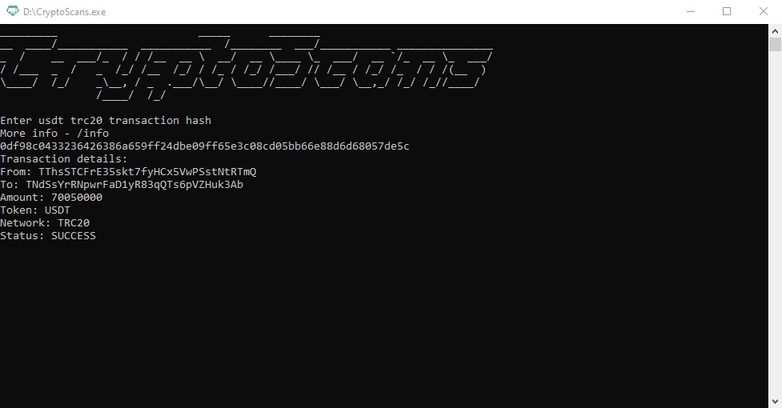

  

<h1 align="center">CryptoScans</h1>

<h3 align="center">
  Crypto transactions scanner by <a href="https://github.com/codelao">CodeLao</a>
</h3>

  <a href="#requirements">Requirements</a> •
  <a href="#usage">Usage</a> •
  <a href="https://github.com/codelao/CryptoScans/tree/main/exe">exe</a>

## Requirements

  
  
  

## Usage

- CryptoScans is a console based crypto transactions scanner based on TRONSCAN API
- You just need to enter any USDT transaction hash based on TRC20 network and here it is (I usually search for TRC20 hashes on the [TRONSCAN](https://tronscan.org/#/) site)
